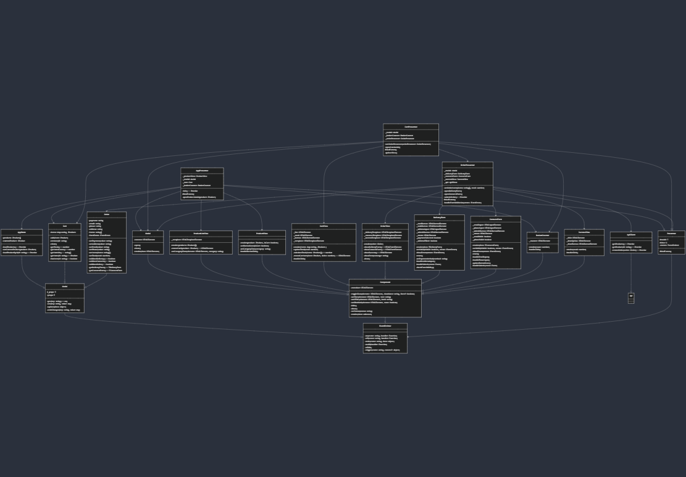

# Проектная работа "Веб-ларек"

Стек: HTML, SCSS, TS, Webpack

Структура проекта:
- src/ — исходные файлы проекта
- src/components/ — папка с JS компонентами
- src/components/base/ — папка с базовым кодом
- src/components/models/ — папка с моделями данных
- src/components/presenters/ — папка с презентерами
- src/components/views/ — папка с представлениями

Важные файлы:
- src/pages/index.html — HTML-файл главной страницы
- src/types/index.ts — файл с типами
- src/index.ts — точка входа приложения
- src/scss/styles.scss — корневой файл стилей
- src/utils/constants.ts — файл с константами
- src/utils/utils.ts — файл с утилитами

## Установка и запуск
Для установки и запуска проекта необходимо выполнить команды

```
npm install
npm run start
```

или

```
yarn
yarn start
```
## Сборка

```
npm run build
```

или

```
yarn build
```

## Архитектура

Приложение реализовано по MVP архитектуре и состоит из компонентов:

| Компонент | Описание | Базовый класс | Связанные классы |
|-----------|-----------|--------------|-----------------|
| Model | Модель данных | Model | - Cart<br>- Order |
| View | Модель отображения | Component | - ProductListView<br>- ProductView<br>- CartView<br>- OrderView<br>- DeliveryForm<br>- ContactsForm<br>- Success |
| Presenter | Модель связи | - | - AppPresenter<br>- CartPresenter<br>- OrderPresenter |



## Базовые классы

### EventEmitter
Реализует паттерн «Наблюдатель». Методы:
- `on`: подписка на событие
- `off`: отписка от события
- `emit`: уведомление подписчиков
- `onAll`: подписка на все события
- `offAll`: сброс всех подписчиков
- `trigger`: создание обработчика, генерирующего событие при вызове

### Component<T extends HTMLElement>
Абстрактный базовый класс для всех представлений, который принимает дженерик Component<T>. Реализует методы для работы с DOM:
- Управление классами элементов
- Установка текстового содержимого
- Управление атрибутами
- Показ/скрытие компонента
- Установка статуса
- Абстрактный метод `render` для отображения данных

### Model<T extends Record<string, any>>
Абстрактный базовый класс для моделей данных, который принимает дженерик Model<T>:
- Связывает данные со свойствами объекта
- Инициализирует события при изменении данных
- Методы для работы с данными: `get`, `set`, `update`
- Метод `emitChanges` для генерации событий при изменении данных

### Presenter<T extends IEvents, U extends IEvents>
Абстрактный базовый класс для всех презентеров:
- Связывает модель и представление
- Обрабатывает события от модели и представления
- Содержит собственный объект `events` для создания событий
- Абстрактный метод `bindEvents` для определения связей между событиями

### Api
Базовый класс для работы с API:
- GET-запросы для получения данных
- POST-запросы для отправки данных
- Обработка ответов API

## Сервисные классы

### ApiClient
Класс для работы с конкретным API приложения:
- `getProducts`: получение списка товаров
- `getProduct`: получение информации о товаре
- `createOrder`: создание заказа

## Компоненты моделей

### AppState
Основная модель приложения:
- Хранит массив всех доступных товаров
- Хранит текущий товар для показа в модальном окне
- Загружает товары через API
- Методы: `loadProducts`, `setCurrentProduct`, `loadProductById`

### Cart
Класс корзины:
- Управляет списком товаров через Map<string, IProduct>
- Рассчитывает общую стоимость
- Методы: `add`, `remove`, `clear`, `getTotal`, `getItemsCount`, `getItemIds`, `getItem`, `hasItem`

### Order
Класс заказа:
- Хранит данные: payment, email, phone, address, items, total
- Валидирует поля формы
- Генерирует события об ошибках валидации
- Методы: `setPayment`, `setAddress`, `setEmail`, `setPhone`, `setItems`, `setTotal`
- Методы валидации: `validateDelivery`, `validateContacts`, `validateOrder`
- Методы получения данных форм: `getDeliveryForm`, `getContactsForm`

## Компоненты представления

### ProductListView
- Отображает каталог товаров на главной странице
- Создает карточки товаров на основе шаблона
- Генерирует события при клике на карточку

### ProductView
- Отображает детальную информацию о товаре в модальном окне
- Отображает статус товара в корзине (в корзине/не в корзине)
- Генерирует события при добавлении/удалении товара из корзины

### CartView
- Отображает содержимое корзины
- Показывает общую стоимость
- Генерирует события при удалении товаров
- Управляет доступностью кнопки оформления заказа

### BasketCounter
- Отображает количество товаров в корзине на иконке корзины
- Генерирует событие открытия корзины при клике

### OrderView
- Управляет отображением разных этапов оформления заказа
- Методы: `showDeliveryForm`, `showContactsForm`, `showSuccess`, `showError`
- Отображает ошибки при оформлении заказа

### DeliveryForm
- Отображает форму выбора способа оплаты и ввода адреса доставки
- Валидирует введенные данные
- Генерирует события при изменении данных формы
- Управляет доступностью кнопки перехода к следующему шагу

### Modal
Класс для работы с модальными окнами:
- Открытие и закрытие модального окна
- Установка содержимого модального окна
- Обработка событий закрытия (по кнопке и по клику на оверлей)

### ContactsForm
- Отображает форму ввода контактных данных
- Валидирует email и телефон
- Генерирует события при изменении данных формы
- Управляет доступностью кнопки отправки заказа

### SuccessView
- Отображает сообщение об успешном оформлении заказа
- Показывает сумму списанных средств
- Генерирует события при закрытии

## Презентеры

### AppPresenter
- Связывает AppState, ProductListView и ProductView
- Управляет отображением списка товаров и деталей товара
- Обрабатывает события открытия карточки товара
- Добавляет/удаляет товары из корзины
- Инициализирует приложение при запуске

### CartPresenter
- Связывает Cart, CartView и BasketCounter
- Управляет отображением корзины
- Обрабатывает события удаления товаров из корзины
- Отображает количество товаров в корзине
- Взаимодействует с OrderPresenter для оформления заказа

### OrderPresenter
- Связывает Order и OrderView
- Управляет процессом оформления заказа
- Обрабатывает ввод данных в формы
- Валидирует формы
- Отправляет заказ на сервер
- Отображает результат оформления заказа

## События
Приложение использует систему событий для коммуникации между компонентами:

- `catalog:changed` - обновление каталога товаров
- `card:open` - открытие карточки товара
- `basket:open` - открытие корзины
- `formErrors:changed` - валидация формы заказа
- `order_delivery:open` - открытие формы доставки
- `delivery:submit` - отправка формы доставки
- `order_contacts:open` - открытие формы контактов
- `contacts:submit` - отправка формы контактов
- `order:post` - отправка заказа
- `payment:changed` - выбор способа оплаты
- `delivery.address:change` - изменение адреса доставки
- `contacts.email:change` - изменение email
- `contacts.phone:change` - изменение телефона
- `modal:open` - открытие модального окна
- `modal:close` - закрытие модального окна
- `order:completed` - успешное завершение заказа

## Интерфейсы и типы

### Основные интерфейсы данных
- `IProduct` - интерфейс товара
- `ICart` - интерфейс корзины
- `IOrder` - интерфейс заказа
- `IModal` - интерфейс модального окна
- `IView` - базовый интерфейс представления
- `ICartView` - интерфейс представления корзины
- `IOrderView` - интерфейс представления заказа
- `IEvents` - интерфейс для работы с событиями
- `IAPIClient` - интерфейс для работы с API

### Типы для форм
- `TDeliveryForm` - тип данных формы доставки (payment, address)
- `TContactsForm` - тип данных формы контактов (email, phone)
- `IFormErrors` - интерфейс для ошибок валидации форм

### Интерфейсы API-ответов
- `IProductsResponse` - ответ API со списком товаров
- `IOrderResult` - результат создания заказа